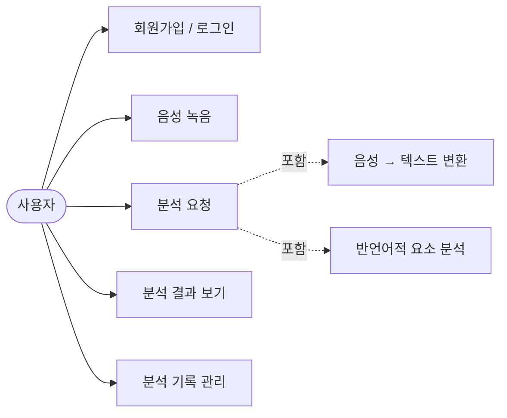
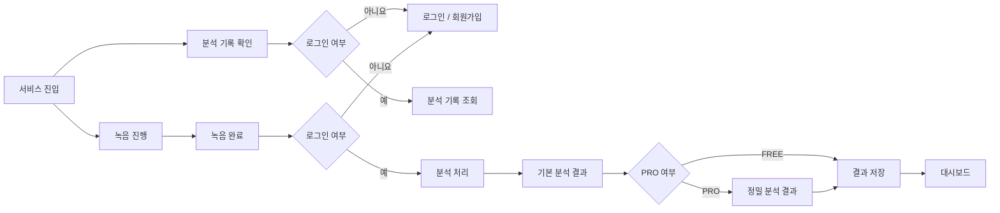
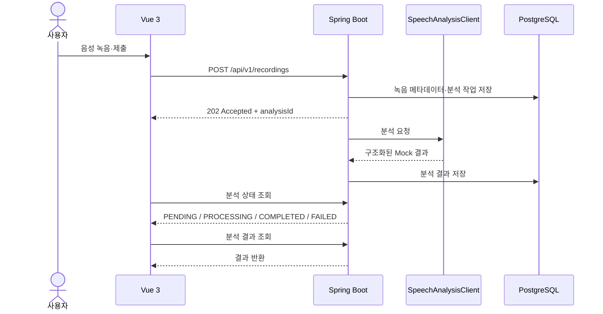
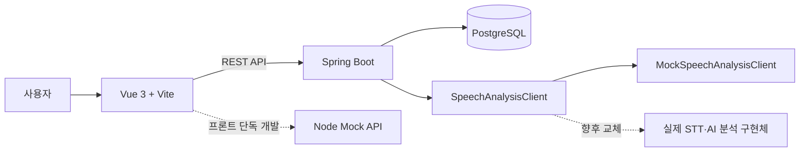

# EJE (이제)

> 말하기 습관을 발견하고, 이제 더 나은 말하기를 연습합니다.

EJE는 면접 자기소개와 발표를 연습하는 사용자를 위한 말하기 습관 분석 서비스입니다. 사용자가 음성을 녹음하거나 파일을 제출하면 추임새, 침묵, 말하기 속도와 반복 표현을 분석하고 결과를 기록합니다.

현재는 외부 AI를 호출하지 않고 Mock 분석 결과를 사용합니다. 음성 분석은 `SpeechAnalysisClient` 인터페이스 뒤에 분리되어 있어 향후 실제 STT·AI 분석 구현체로 교체할 수 있습니다.

## 주요 기능

- 회원가입, 로그인, 로그아웃
- 브라우저 음성 녹음 또는 음성 파일 업로드
- 비동기 분석 접수와 진행 상태 확인
- 추임새 횟수와 표현별 분석 결과 조회
- 파형, 침묵, 말하기 속도와 구간별 상세 분석
- 분석 기록, 비교 결과, 추이와 주간 리포트 조회
- 실패한 분석의 수동 재시도

현재 Mock 분석에서 탐지하는 표현은 다음과 같습니다.

- 추임새: `음`, `어`
- 습관어: `그러니까`, `약간`, `사실`

`아`, `이제`와 같은 표현은 실제 STT·AI 분석 연동 단계에서 확장할 수 있습니다.

## Use Case



현재 프로젝트에서는 음성→텍스트 변환과 반언어적 요소 분석 영역을 `MockSpeechAnalysisClient`가 대신합니다.

## User Flow



프로젝트에는 FREE/PRO 결과 분기가 구현되어 있으며, 별도의 결제 기능은 현재 범위에 포함하지 않습니다.

## 동작 흐름



## 시스템 구조



- 프론트엔드는 Vue 화면, API 호출, 인증 상태와 분석 폴링을 담당합니다.
- 백엔드는 인증, 음성 업로드 검증, 분석 상태 전이와 결과 저장을 담당합니다.
- PostgreSQL에는 사용자, 녹음 메타데이터, 분석 상태와 구조화된 결과를 저장합니다.
- 음성 원본과 전사문은 영구 저장하지 않습니다.
- Node Mock API는 백엔드 없이 프론트엔드 화면을 개발할 때 사용합니다.

## 분석 상태

```text
PENDING → PROCESSING → COMPLETED
                     ↘ FAILED → 재시도
```

음성 분석 요청은 `202 Accepted`로 접수됩니다. 프론트엔드는 상태 API를 폴링하고, 완료되면 결과 화면으로 이동합니다. 분석 실패는 HTTP 오류가 아니라 `FAILED` 상태와 `failureCode`로 전달됩니다.

## 기술 스택

| 영역 | 기술 |
| --- | --- |
| Frontend | Vue 3, Vite, Vue Router, Pinia, Axios |
| Backend | Java 21, Spring Boot 4.1, Spring MVC, Spring Security, Spring Data JPA |
| Database | PostgreSQL 16 |
| Audio | MediaRecorder, Web Audio API, FFmpeg |
| Infrastructure | Docker, Docker Compose |
| Mock | Node Mock API, `MockSpeechAnalysisClient` |

## 프로젝트 구조

```text
.
├── frontend/          # Vue 3 프론트엔드 및 Node Mock API
├── backend/           # Spring Boot API와 분석 파이프라인
├── db/                # PostgreSQL 스키마 및 초기 데이터
├── docs/              # 프로젝트 문서
├── docker-compose.yml # 통합 실행 환경
└── .env.example       # 환경변수 예시
```

## 실행 방법

### 전체 통합 실행

루트 환경 파일에 DB 접속 정보와 JWT 비밀키를 설정합니다. `.env`는 Git에 포함하지 않습니다.

```bash
cp .env.example .env
docker compose up --build -d
```

프론트엔드 환경 파일을 준비한 뒤 실행합니다.

```bash
cd frontend
cp .env.real.example .env.real.local
# VITE_API_BASE_URL=http://localhost:8080/api/v1 입력
npm install
npm run dev:real
```

브라우저에서 `http://localhost:5173`에 접속합니다.

### 프론트엔드 Mock 실행

```bash
cd frontend
cp .env.mock.example .env.mock.local
# VITE_API_BASE_URL=http://127.0.0.1:18080/api/v1 입력
npm install
npm run mock:api
```

다른 터미널에서 실행합니다.

```bash
cd frontend
npm run dev:mock
```

## 검증

```bash
cd frontend
npm run build
```

백엔드 테스트는 스키마와 시드가 적용된 PostgreSQL 및 테스트용 환경변수를 준비한 뒤 실행합니다.

```bash
cd backend
./gradlew test
```

## AI 확장 지점

`AnalysisExecutor`는 구체 구현체가 아니라 `SpeechAnalysisClient` 인터페이스에 의존합니다. 따라서 실제 분석 연동 시 새 구현체와 설정을 추가하더라도 기존 컨트롤러, 프론트엔드 API와 데이터베이스 결과 구조를 유지할 수 있습니다.

> 현재는 Mock이 분석을 담당하지만, 실제 분석기가 들어올 자리는 코드에 분리되어 있습니다.
